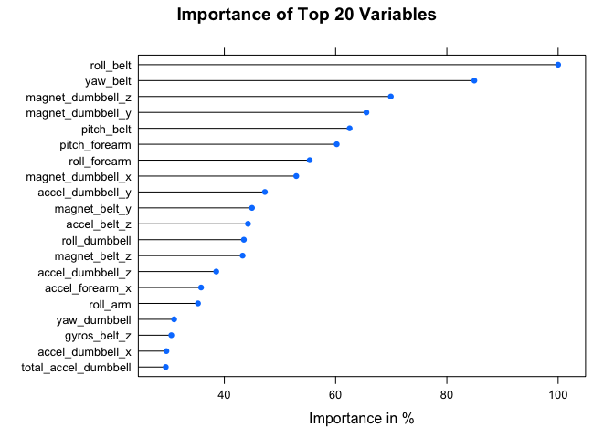

# Weight Lifting Exercise Analysis
Christoph Fabianek  
`r format(Sys.time(), "%A, %B %d, %Y")`  

## Overview
This project investigates data collected during weight lifting exercises and applys a machine learning algorithm from the CARET Package of the R programming language to predict the manner in which exercises were performed. This report was written for the course *Practical Machine Learning* of the *Coursera Data Science Specialization*.


## Introduction
Using devices such as Jawbone Up, Nike FuelBand, and Fitbit it is now possible to collect a large amount of data about personal activity relatively inexpensively. These type of devices are part of the quantified self movement – a group of enthusiasts who take measurements about themselves regularly to improve their health, to find patterns in their behavior, or because they are tech geeks. One thing that people regularly do is quantify how much of a particular activity they do, but they rarely quantify how well they do it. In this project, the goal is  to use data from accelerometers on the belt, forearm, arm, and dumbell of 6 participants. They were asked to perform barbell lifts correctly and incorrectly in 5 different ways. More information is available from the website here:  [http://groupware.les.inf.puc-rio.br/har](http://groupware.les.inf.puc-rio.br/har).

## Data Processing
First the underlying [training](https://d396qusza40orc.cloudfront.net/predmachlearn/pml-training.csv) and [test data](https://d396qusza40orc.cloudfront.net/predmachlearn/pml-testing.csv) are downloaded from the web and read. For the scope of this analysis the data is cleaned in the following way:

* remove the first 7 columns (`X`, `user_name`, `time_stamps`, `*_window`) since they are not relevant for classification
* remove columns with over 60% NAs
* remove near zero variance predictors
* convert `classe` into a factor variable


Afterwards the dataset is split into a 60% training and a 40% testing set.


## Model Fitting
Based on various tests *Random Forest* with 10 fold *Cross Validation* is chosen as algorithm to get a small out of sample error. (For performance reason a parallel cluster is setup.)  

```r
cluster <- makeCluster(detectCores()-1)
registerDoParallel(cluster)
ctrl <- trainControl(method = "cv",
                     number = 10,
                     allowParallel = TRUE)
model <- train(classe ~ ., data = data_training, method = "rf", 
               trControl = ctrl, prox = FALSE)
stopCluster(cluster)
```

## Result


To get an unbiased estimate of the models performance (*Random Forest* with 10-fold *Cross Validation*) it is applied to the so far untouched testing dataset:

* The `confusionMatrix` states an **Accuracy of 99.12%**.  
* The expected **Out-of-sample Error is 0.87%**.

Finally, the following figure shows the importance of the variables:
 

## Conclusion
The *Random Forest* algorithm with *Cross Validation* provides great results (high accuracy and low error rate) out of the box without much tweaking. It was interesting to experiment with various parameters for the used algorithms to improve performance on the local machine. Nevertheless, the overall best result was achieved with default settings.


## Appendix

### Initialize and load the data
R code for loading the required libraries and loading the data  


```r
# load libraries
library(caret)
library(randomForest)
library(parallel)
library(doParallel)

# load & read data
setwd("~/Documents/coursera/dataScience/MachineLearning")
if(!file.exists("data")) {
        dir.create("data")
}
if(!file.exists('./data/pml-training.csv')) {
        fileUrl <- "https://d396qusza40orc.cloudfront.net/predmachlearn/pml-training.csv"
        download.file(fileUrl,
                      destfile="./data/pml-training.csv",
                      method="curl")
        dateDownloaded_training <- date()
}
training <- read.csv("./data/pml-training.csv", header = TRUE)

if(!file.exists('./data/pml-testing.csv')) {
        fileUrl <- "https://d396qusza40orc.cloudfront.net/predmachlearn/pml-testing.csv"
        download.file(fileUrl,
                      destfile="./data/pml-testing.csv",
                      method="curl")
        dateDownloaded_test20 <- date()
}
test20 <- read.csv("./data/pml-testing.csv", header = TRUE)
```

### Data Cleaning
R code for cleaning the data  


```r
# remove first 7 columns
training <- training[, 8:ncol(training)]

# remove columns with >60% NAs
NAs <- apply(training, 2, function(x) {sum(is.na(x))})
training <- training[, which(NAs < nrow(training)*0.6)]

# remove near zero variance predictors
NZVs <- nearZeroVar(training, saveMetrics = TRUE)
training <- training[, NZVs$nzv == FALSE]

# convert classe into factor
training$classe <- factor(training$classe)
```

### Splitting in Testing and Training Set
R code for splitting data in a testing and training set  


```r
set.seed(210777)
trainset <- createDataPartition(training$classe, p = 0.6, list = FALSE)
data_training <- training[trainset, ]
data_testing <- training[-trainset, ]
```

### Evaluating the Model
R code for evaluating the model

```r
prediction <- predict(model, data_testing)

# confusionMatrix to get accuracy
print(confusionMatrix(prediction, data_testing$classe))
```

```
## Confusion Matrix and Statistics
## 
##           Reference
## Prediction    A    B    C    D    E
##          A 2232   21    0    0    0
##          B    0 1496   14    0    0
##          C    0    1 1354   26    1
##          D    0    0    0 1256    3
##          E    0    0    0    4 1438
## 
## Overall Statistics
##                                         
##                Accuracy : 0.991         
##                  95% CI : (0.989, 0.993)
##     No Information Rate : 0.284         
##     P-Value [Acc > NIR] : <2e-16        
##                                         
##                   Kappa : 0.989         
##  Mcnemar's Test P-Value : NA            
## 
## Statistics by Class:
## 
##                      Class: A Class: B Class: C Class: D Class: E
## Sensitivity             1.000    0.986    0.990    0.977    0.997
## Specificity             0.996    0.998    0.996    1.000    0.999
## Pos Pred Value          0.991    0.991    0.980    0.998    0.997
## Neg Pred Value          1.000    0.997    0.998    0.995    0.999
## Prevalence              0.284    0.193    0.174    0.164    0.184
## Detection Rate          0.284    0.191    0.173    0.160    0.183
## Detection Prevalence    0.287    0.192    0.176    0.160    0.184
## Balanced Accuracy       0.998    0.992    0.993    0.988    0.998
```

```r
# calculate out-of-sample error
oos_error <- sum(prediction != data_testing$classe)/length(data_testing$classe)

# list to show 20 most imporatant varables in descending order
print(varImp(model))
```

```
## rf variable importance
## 
##   only 20 most important variables shown (out of 52)
## 
##                      Overall
## roll_belt              100.0
## yaw_belt                84.9
## magnet_dumbbell_z       69.9
## magnet_dumbbell_y       65.5
## pitch_belt              62.5
## pitch_forearm           60.2
## roll_forearm            55.3
## magnet_dumbbell_x       52.9
## accel_dumbbell_y        47.3
## magnet_belt_y           45.0
## accel_belt_z            44.2
## roll_dumbbell           43.5
## magnet_belt_z           43.3
## accel_dumbbell_z        38.5
## accel_forearm_x         35.8
## roll_arm                35.3
## yaw_dumbbell            31.0
## gyros_belt_z            30.5
## accel_dumbbell_x        29.6
## total_accel_dumbbell    29.5
```

### Prediction Assignment Submission
The generated model is applied to the original [test data](https://d396qusza40orc.cloudfront.net/predmachlearn/pml-testing.csv) stored in `test20` and written to `problem_id_X.txt` according to the instructions.


```r
# write output to file according to instructions
pml_write_files = function(x) {
    n = length(x)
    for (i in 1:n) {
        filename = paste0("problem_id_", i, ".txt")
        write.table(x[i], file = filename, quote = FALSE, row.names = FALSE, 
            col.names = FALSE)
    }
}
pml_write_files(as.vector(predict(model, test20)))
```
